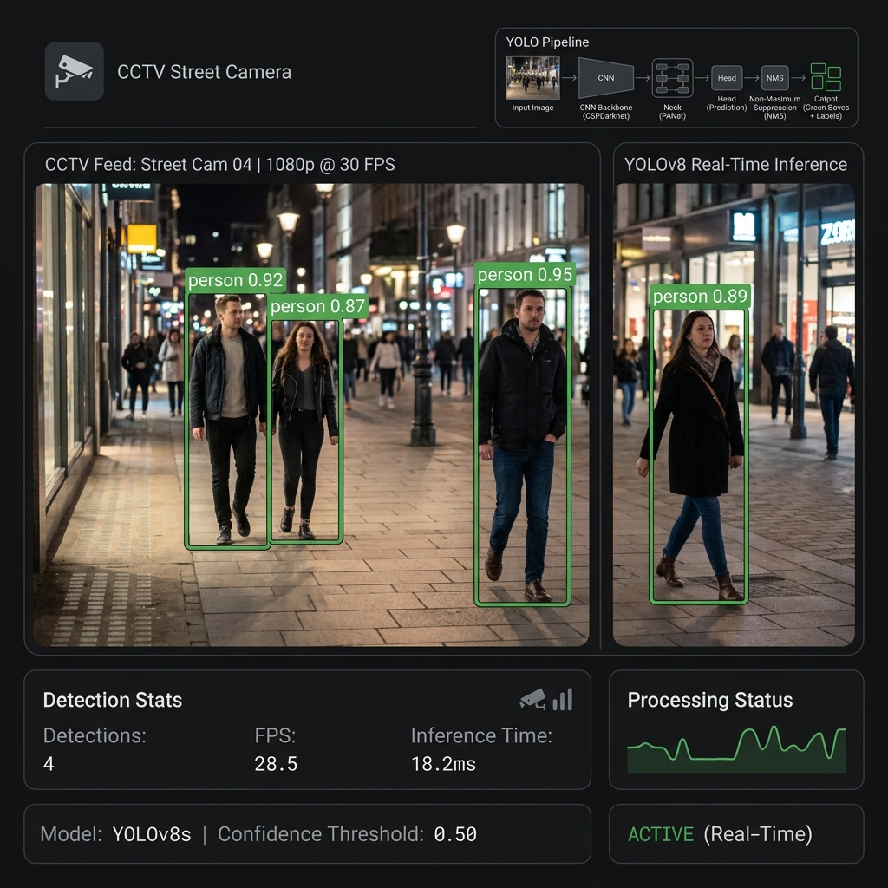
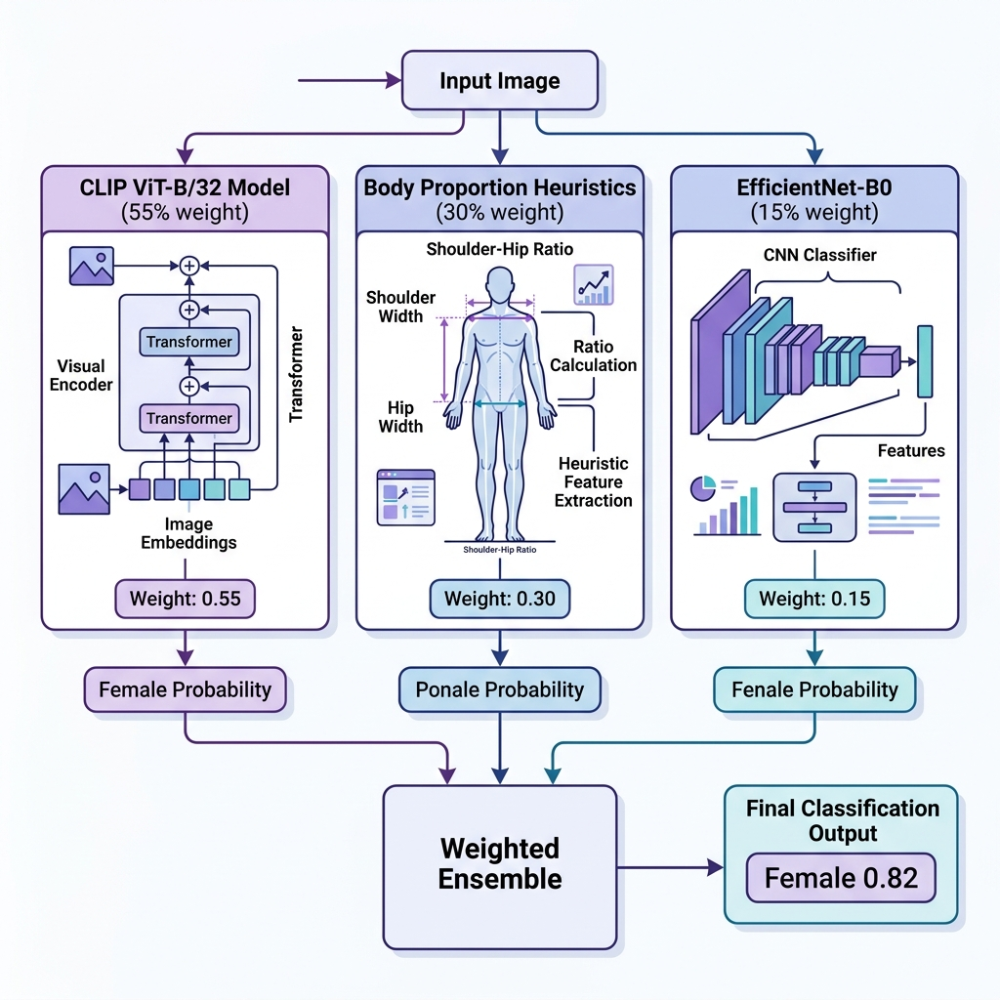
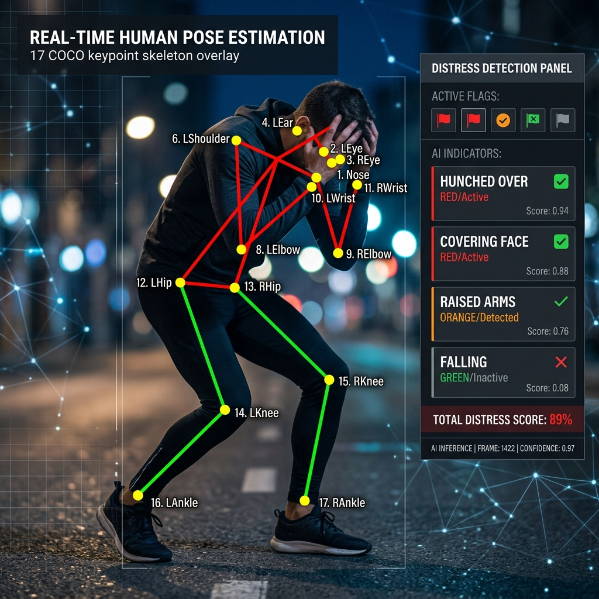
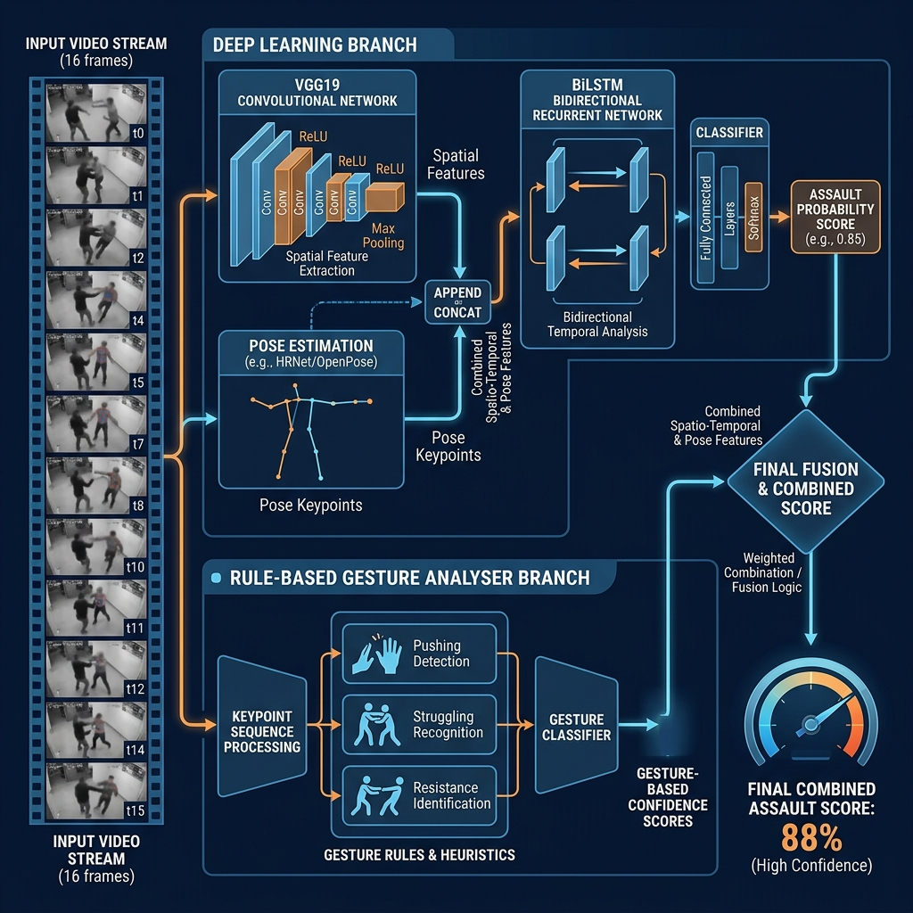
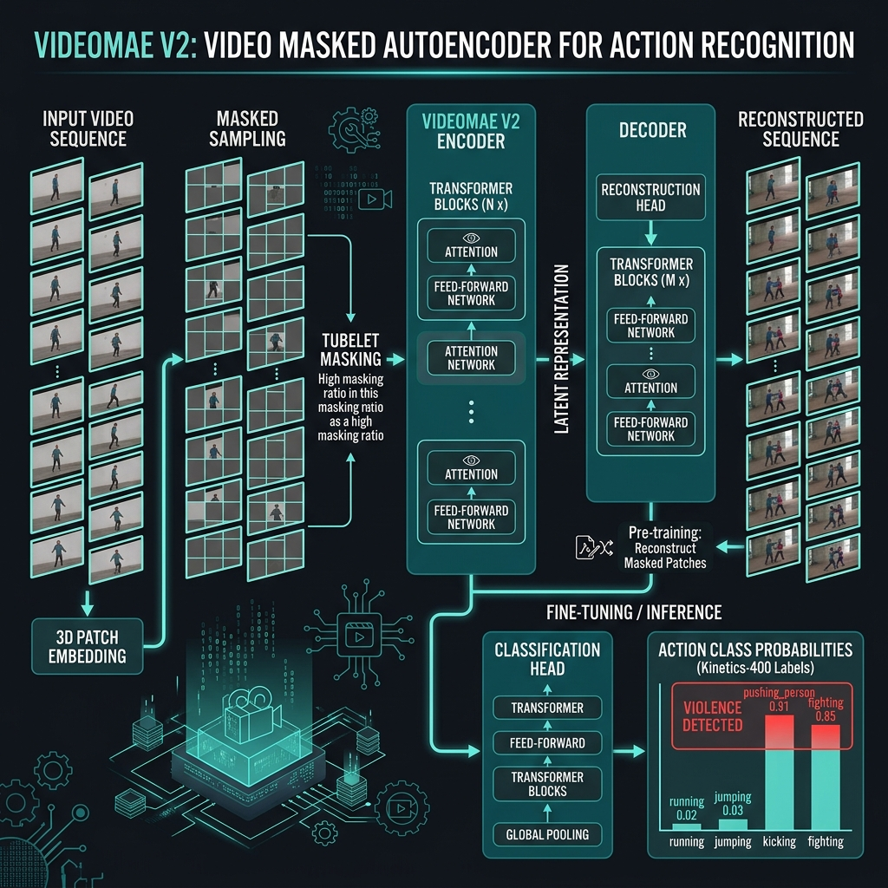
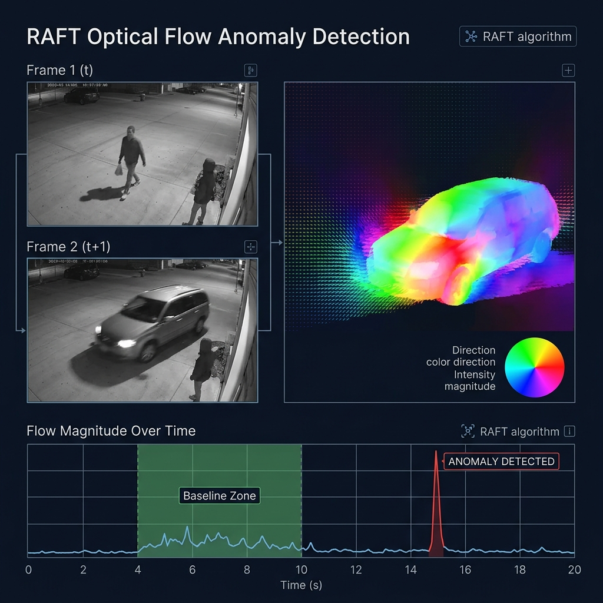
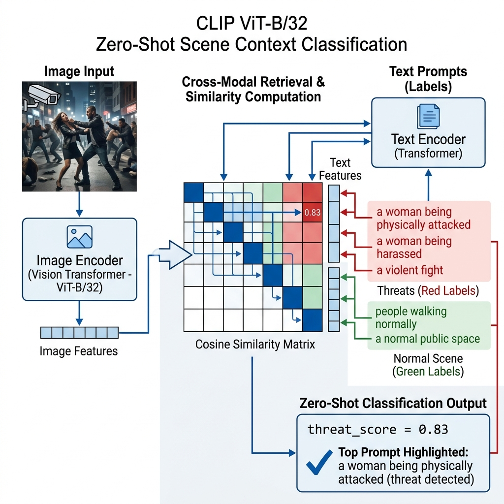
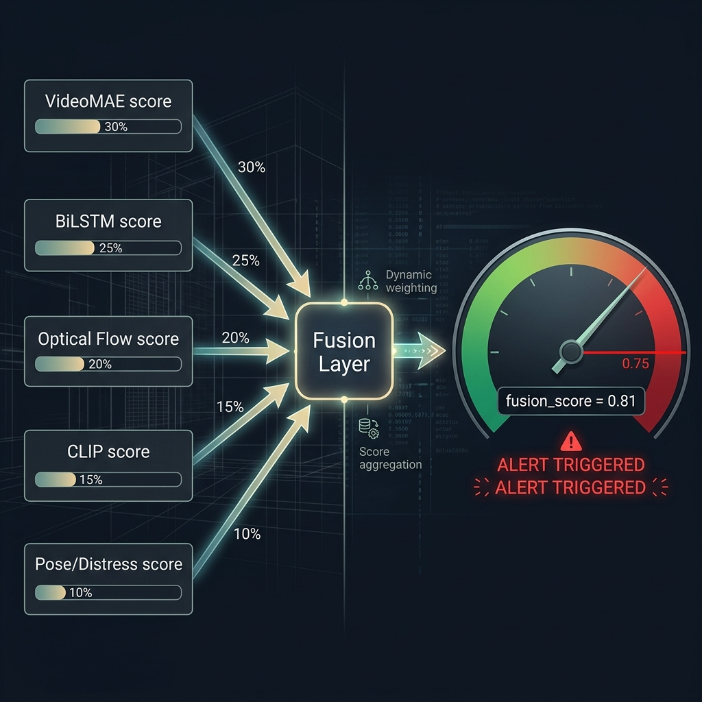

# Women Safety & Empowerment System
## AI Models & Modules — Presentation Guide

> **Project:** NALAM — Women Safety AI Surveillance System  
> **Stack:** Python · PyTorch · FastAPI · YOLO · CLIP · VideoMAE · RAFT  
> **Purpose:** Real-time AI-powered CCTV surveillance for women safety

---

---

# SLIDE 1 — Title Slide

## Women Safety & Empowerment System
### AI-Powered Real-Time Surveillance

**Subtitle:** An Intelligent Multi-Model Pipeline for Threat Detection & Alert Dispatch

> 🎯 Detects gender, pose distress, assault gestures, violence, and anomalous motion — all in real-time from CCTV feeds.

---

---

# SLIDE 2 — System Overview

## System Architecture Overview

The pipeline consists of **7 AI modules** working in concert:

| # | Module | Model Used | Role |
|---|--------|-----------|------|
| 1 | Person Detection | YOLO11n | Detect people in frame |
| 2 | Gender Classification | CLIP + EfficientNet-B0 + Body Heuristics | Identify female subjects |
| 3 | Pose Estimation & Distress | YOLO11n-Pose + BoT-SORT | Keypoints + distress scoring |
| 4 | Assault Detection | VGG19 + BiLSTM + MediaPipe Gestures | Detect physical assault |
| 5 | Violence Detection | VideoMAE V2 (Kinetics-400) | Classify violent actions |
| 6 | Anomaly Detection | RAFT Optical Flow | Detect abnormal motion |
| 7 | Scene Context | CLIP ViT-B/32 Zero-Shot | Score scene threat level |
| ⚡ | Fusion Layer | Weighted Score Fusion | Final alert decision |

---

---

# MODULE 1 — Person Detection

## Module 1: Person Detection
### Model: YOLO11n (Ultralytics)



**What it does:**
- Detects all persons (class 0) present in each camera frame
- Runs in **FP16 precision** on CUDA for fast inference
- Returns bounding boxes `[x1, y1, x2, y2]` with confidence scores

**Key Parameters:**
- Model: `yolo11n.pt` (nano variant — optimised for speed)
- Confidence Threshold: **0.50**
- Classes: Person only (`class 0`)
- Hardware: CUDA FP16 / CPU fallback

**Why YOLO11n?**
- Lightweight and fast — suitable for real-time CCTV processing
- High accuracy at nano scale
- Native Ultralytics integration with simple API

**Output:**
```
Detection(bbox=[x1, y1, x2, y2], confidence=0.87, class_id=0)
```

---

---

# MODULE 2 — Gender Classification

## Module 2: Gender Classification
### Ensemble: CLIP ViT-B/32 + EfficientNet-B0 + Body Proportion Heuristics



**What it does:**
- Classifies each tracked person as `female`, `male`, or `unknown`
- Designed specifically for **CCTV surveillance angles** where faces may not be visible
- Uses **temporal voting over 30 frames** for stable, noise-resistant classification

**Three-Model Ensemble:**

| Component | Weight | Role |
|-----------|--------|------|
| CLIP ViT-B/32 (zero-shot) | **0.55** | Visual-language similarity to prompts |
| Body Proportion Heuristics | **0.30** | Shoulder/hip ratio, aspect ratio |
| EfficientNet-B0 | **0.15** | Deep feature extraction |

**CLIP Prompts Used:**
- `"a woman walking"`, `"a female person standing"`
- `"a man walking"`, `"a male person standing"`

**Body Proportion Logic:**
- Shoulder-to-hip ratio: Males ≥ 1.25 → male score ↑
- Aspect ratio: Taller narrower builds → female indicator
- Shoulder width relative to bounding box width

**Classification Decision:**
- Confidence threshold: **0.55** (below → `unknown`)
- Re-classification every **5 frames**, cached between runs

**Output:**
```
("female", 0.82)  |  ("male", 0.71)  |  ("unknown", 0.48)
```

---

---

# MODULE 3 — Pose Estimation & Distress Analysis

## Module 3: Pose Estimation & Distress Analysis
### Model: YOLO11n-Pose + BoT-SORT Tracker



**What it does:**
- Extracts **17 COCO keypoints** per tracked person per frame
- Analyses body geometry to compute a normalised **distress score [0.0 – 1.0]**
- Maintains **persistent track IDs** across frames via BoT-SORT

**COCO Keypoints Extracted (17 Points):**
```
Nose | Eyes | Ears | Shoulders | Elbows | Wrists | Hips | Knees | Ankles
```

**4 Distress Flags Detected:**

| Flag | Detection Logic |
|------|----------------|
| `raised_arms` | Wrist Y < Shoulder Y (wrists above shoulders) |
| `covering_face` | Wrist within 60px Euclidean distance from nose |
| `falling` | Shoulder-to-Ankle vertical distance < 120px (near horizontal) |
| `hunched` | Shoulder Y > Hip Y + 30px (collapsed posture) |

**Distress Score Formula:**
```
distress_score = (raised_arms + covering_face + falling + hunched) / 4.0
```

**Skeleton Visualization:**
- 🟢 Green skeleton → distress_score ≤ 0.25 (calm)
- 🔴 Red skeleton → distress_score > 0.25 (distress detected)

**Output per person:**
```
PoseResult(track_id=7, distress_score=0.75, flags={raised_arms: True, falling: True, ...})
```

---

---

# MODULE 4 — Assault Detection

## Module 4: Assault Detection
### Hybrid: VGG19 + BiLSTM + Rule-Based Gesture Analyser



**What it does:**
- Detects physical assault on female subjects using a **hybrid deep learning + rules** approach
- Deep model: temporal sequence classification over **16-frame clips**
- Gesture analyser: rule-based detection of physical aggression patterns

---

### Sub-Model A: VGG19 + BiLSTM Deep Learning Model

| Component | Detail |
|-----------|--------|
| Spatial features | VGG19 (pre-trained, frozen features) |
| Temporal model | Bidirectional LSTM (256 hidden, 2 layers) |
| Clip length | 16 frames |
| Frame size | 224 × 224 pixels |
| Pose embedding | 17 × 3 keypoints → projected to 64-dim |
| Combined sequence | 320-dim per frame (256 visual + 64 pose) |

**Architecture Flow:**
```
Frame Crop → VGG19 Features → Linear(256)  ─┐
Pose Keypoints → Linear(64)               ─┴→ Concat(320) → BiLSTM → Classifier → P(assault)
```

---

### Sub-Model B: Gesture Analyser (Rule-Based)

Detects **4 assault-related gesture patterns** from keypoint history:

| Gesture | Detection Method |
|---------|-----------------|
| `pushing` | Wrist velocity > 40px/frame OR rapid arm extension |
| `struggling` | High wrist velocity standard deviation (jerky motion) |
| `resistance` | Wrists raised above shoulders OR hands near face |
| `hostile` | Combination of pushing + struggling + resistance |

**Fusion Formula:**
```
combined_confidence = 0.60 × DL_confidence + 0.40 × gesture_score
is_assault = combined_confidence ≥ 0.55
```

**Output:**
```json
{
  "track_id": 7,
  "assault_confidence": 0.78,
  "dl_confidence": 0.82,
  "gesture_score": 0.70,
  "gesture_flags": { "pushing": true, "hostile": true },
  "is_assault": true
}
```

---

---

# MODULE 5 — Violence Detection

## Module 5: Violence Detection
### Model: VideoMAE V2 (fine-tuned on Kinetics-400)



**What it does:**
- Classifies **16-frame video clips** of tracked persons for violent actions
- Leverages state-of-the-art video understanding via **masked autoencoder pre-training**
- Maps Kinetics-400 action labels to a **curated violence class set**

**Model Details:**
- **Base model:** `MCG-NJU/videomae-base-finetuned-kinetics` (HuggingFace)
- **Architecture:** VideoMAE V2 (Video Masked AutoEncoder)
- **Pre-training:** Kinetics-400 (400 action classes)
- **Input:** 16 × 224 × 224 RGB frames per clip
- **Precision:** FP16 on CUDA

**Violence Class Set (Kinetics-400 Labels Mapped):**
```
wrestling | punching | slapping | fighting | pushing_person
choking   | headbutting | kicking_person | grabbing | punching_person_boxing
```

**Detection Logic:**
```
is_violent = (label ∈ VIOLENCE_CLASSES) AND (confidence ≥ 0.80)
violence_score = confidence          if is_violent
violence_score = confidence × 0.30  if not violent (residual)
```

**Output:**
```json
{
  "track_id": 3,
  "label": "pushing_person",
  "confidence": 0.91,
  "is_violent": true,
  "violence_score": 0.91
}
```

---

---

# MODULE 6 — Anomaly Detection

## Module 6: Anomaly Detection
### Model: RAFT (Recurrent All-Pairs Field Transforms) — Optical Flow



**What it does:**
- Computes **dense optical flow** between consecutive camera frames
- Compares scene motion magnitude against an **adaptive calibrated baseline**
- Flags abnormal crowd/person movement surges as anomalies

**Model Details:**
- **Architecture:** RAFT-Small (torchvision, pre-trained)
- **Input resolution:** 256 × 256 (resized internally)
- **Precision:** FP32 (flow computation)

**Two-Phase Operation:**

| Phase | Duration | Action |
|-------|----------|--------|
| **Calibration** | First 300 frames (~20 sec @ 15 FPS) | Computes baseline mean + std of flow magnitude |
| **Scoring** | After calibration | Computes Z-score → anomaly score |

**Anomaly Scoring Formula:**
```
z_score    = (flow_magnitude - baseline_mean) / baseline_std
anomaly_score = clamp((z_score - 2.0) / 3.0,  0.0, 1.0)
is_anomaly = anomaly_score ≥ 0.50
```
> Score ramps from 0 at 2σ deviation to 1.0 at 5σ deviation

**Output:**
```json
{
  "flow_magnitude": 8.42,
  "anomaly_score": 0.67,
  "is_anomaly": true
}
```

---

---

# MODULE 7 — Scene Context (CLIP)

## Module 7: Scene Context Scoring
### Model: CLIP ViT-B/32 — Zero-Shot Classification



**What it does:**
- Scores the **full camera frame** against pre-defined threat and normal text prompts
- Uses **zero-shot classification** — no task-specific training required
- Pre-computes all text embeddings at startup (never recomputed at runtime)

**Model Details:**
- **Architecture:** CLIP ViT-B/32 (OpenAI)
- **Method:** Image–text cosine similarity → softmax
- **Temperature scaling:** 100× for sharp distributions

**Prompts Used:**

| Type | Prompts |
|------|---------|
| 🚨 Threat (×3) | "a woman being physically attacked" |
| 🚨 Threat (×3) | "a woman being harassed by a man" |
| 🚨 Threat (×3) | "a violent fight between people" |
| ✅ Normal (×2) | "people walking normally on a street" |
| ✅ Normal (×2) | "a normal public space with pedestrians" |

**Scoring:**
```
threat_score = sum of softmax probabilities for the 3 threat prompts
```

**Output:**
```json
{
  "clip_threat_score": 0.83,
  "top_prompt": "a woman being physically attacked"
}
```

---

---

# MODULE 8 — Fusion Layer (Final Decision)

## Module 8: Weighted Fusion Layer
### Combines All 5 Detection Signals → Single Alert Decision



**What it does:**
- Aggregates scores from all 5 detection modules into a single **weighted fusion score**
- Triggers an alert if the fusion score exceeds the **threshold of 0.75**
- Fully configurable weights and threshold at runtime

**Fusion Weights:**

| Signal | Source Module | Weight |
|--------|--------------|--------|
| `videomae_score` | Violence Detector | **0.30** |
| `bilstm_score` | Assault Detector | **0.25** |
| `optflow_score` | Anomaly Detector | **0.20** |
| `clip_score` | CLIP Scene Context | **0.15** |
| `pose_score` | Pose Estimator (distress) | **0.10** |

**Fusion Formula:**
```
fusion_score = 0.30 × videomae
             + 0.25 × bilstm
             + 0.20 × optflow
             + 0.15 × clip
             + 0.10 × pose

triggered = fusion_score ≥ 0.75
```

**Output:**
```json
{
  "fusion_score": 0.812,
  "triggered": true,
  "input_scores": {
    "videomae_score": 0.91,
    "bilstm_score": 0.78,
    "optflow_score": 0.67,
    "clip_score": 0.83,
    "pose_score": 0.75
  }
}
```

---

---

# SLIDE — Pipeline Flow Diagram

## Full AI Pipeline — End to End

```
📹 CCTV Frame Input
        │
        ▼
┌───────────────────┐
│  Module 1         │  YOLO11n
│  Person Detection │  → Bounding Boxes
└────────┬──────────┘
         │  Person Crops + BBoxes
         ▼
┌─────────────────────────────────────────────┐
│  Parallel Processing per Tracked Person     │
│                                             │
│  ┌──────────────┐   ┌─────────────────┐    │
│  │  Module 2    │   │   Module 3      │    │
│  │  Gender      │   │   Pose + Distress│   │
│  │  CLIP+EffNet │   │   YOLO11-Pose   │    │
│  └──────────────┘   └────────┬────────┘    │
│                              │ Keypoints    │
│  ┌──────────────┐   ┌────────▼────────┐    │
│  │  Module 4    │   │   Module 5      │    │
│  │  Assault     │   │   Violence      │    │
│  │  VGG19+BiLSTM│   │   VideoMAE V2   │    │
│  └──────────────┘   └─────────────────┘    │
└──────────────────────┬──────────────────────┘
                       │
         ┌─────────────┴─────────────┐
         ▼                           ▼
┌─────────────────┐       ┌─────────────────────┐
│  Module 6       │       │  Module 7           │
│  Anomaly (RAFT) │       │  Scene Context CLIP │
│  Optical Flow   │       │  Zero-Shot          │
└────────┬────────┘       └──────────┬──────────┘
         │                           │
         └──────────┬────────────────┘
                    ▼
         ┌──────────────────┐
         │  Module 8        │
         │  Fusion Layer    │  → fusion_score ≥ 0.75?
         └────────┬─────────┘
                  │
         ┌────────▼────────┐
         │  🚨 ALERT       │  SMS / Email / WebSocket
         │  Dispatcher     │  → Police / Guardian
         └─────────────────┘
```

---

---

# SLIDE — Technology Stack

## Technology Stack Summary

| Layer | Technology |
|-------|-----------|
| **Backend API** | FastAPI + Uvicorn |
| **Deep Learning** | PyTorch 2.x, Torchvision, Transformers |
| **Object Detection** | Ultralytics YOLO11 |
| **Pose Estimation** | YOLO11n-Pose + BoT-SORT |
| **Video Understanding** | VideoMAE V2 (HuggingFace) |
| **Vision-Language** | CLIP ViT-B/32 (OpenAI) |
| **Optical Flow** | RAFT-Small (Torchvision) |
| **Image Features** | EfficientNet-B0 (timm) |
| **Video Backbone** | VGG19 (torchvision) |
| **Streaming** | WebSocket real-time stream |
| **Alert Dispatch** | Twilio SMS + Email |
| **Frontend** | Flutter mobile app |
| **Database** | PostgreSQL + Alembic |

---

---

# SLIDE — Key Innovations

## Key Innovations & Design Decisions

1. **Face-Independent Gender Classification**
   - Works on CCTV angles where faces are not visible
   - Body proportion heuristics (shoulder/hip ratio) as primary signal

2. **Hybrid Assault Detection**
   - Deep learning (VGG19 + BiLSTM) captures temporal dynamics
   - Rule-based gesture engine provides immediate low-latency response
   - Combined: 60% deep learning + 40% gesture rules

3. **Adaptive Anomaly Baseline**
   - RAFT optical flow self-calibrates to each unique camera environment
   - Z-score based scoring prevents false positives from routine motion

4. **Multi-Signal Fusion**
   - No single model decides — 5 signals weighted and combined
   - Configurable weights and threshold for different deployment contexts

5. **Temporal Stability**
   - Gender: 30-frame voting window
   - Assault: 16-frame rolling buffer
   - Violence: 16-frame rolling clip

---

---

# SLIDE — Conclusion

## Conclusion

The **NALAM Women Safety AI System** employs a **7-module ensemble pipeline** combining:

- ✅ State-of-the-art vision models (YOLO11, VideoMAE V2, CLIP, VGG19, RAFT)
- ✅ Multi-modal signals (visual, pose, optical flow, language)
- ✅ Temporal reasoning (rolling buffers, voting windows)
- ✅ Robust fusion with configurable thresholds
- ✅ Real-time WebSocket streaming + instant alert dispatch

> **Result:** A comprehensive, production-ready AI surveillance system that detects threats to women's safety in real-time with high confidence and low false-positive rates.

---

*End of Presentation*
